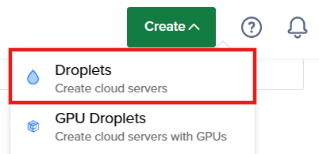
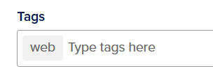
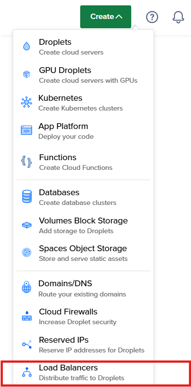
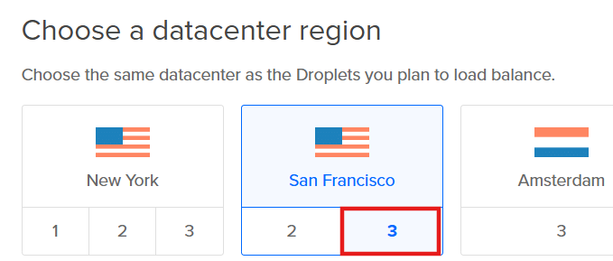
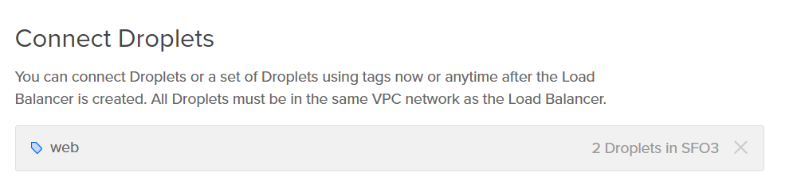
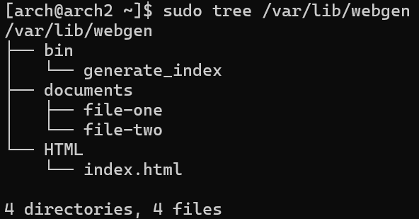

Hi, I'm Hillary. This repository will allow you to set up a

## Table of Contents
>[!Note] After section 2, complete all remaining instruction sections for each droplet

- [Table of Contents](#table-of-contents)
- [1. Creating Droplets](#1-creating-droplets)
- [2. Creating a Load Balancer](#2-creating-a-load-balancer)
- [3. Connecting to and setting up the Droplet](#3-connecting-to-and-setting-up-the-droplet)
- [4. Creating a system user](#4-creating-a-system-user)
- [5. Moving files and creating directories](#5-moving-files-and-creating-directories)
- [6. Setting permissions](#6-setting-permissions)
- [7. Starting and enabling timers and services](#7-starting-and-enabling-timers-and-services)
- [8. Configuring server with nginx](#8-configuring-server-with-nginx)
- [9. Setting up UFW](#9-setting-up-ufw)
- [10. Updating server configuration to include a file server!](#10-updating-server-configuration-to-include-a-file-server)

## 1. Creating Droplets

1. Go to DigitalOcean and click on the **Create** button on the navigation bar
2. Select **Droplet** <br>


Follow the default process for creating a droplet. All you need to change for this project is:
- Change the region to San Francisco
- Change the datacenter location to Datacenter 3 - SFO3
- Use a custom Arch Linux image (newest one available)
- Ensure an SSH key suitable for this purpose is selected
- Change droplet quantity to 2 since we are creating 2 droplets
- In Tags, create a web tag by typing "web" <br>

- (Optional) Give your droplets appropriate names. 
We'll be naming our droplets "arch1" and "arch2"

3. Click **Create Droplet**

## 2. Creating a Load Balancer

1. Go to DigitalOcean and click on the **Create** button on the navigation bar
2. Select **Load Balancers** <br>


You can leave most of the default settings alone. All you need to change for this project is:
- Select San Francisco data center region 3 <br>


- Under Connect Droplets, type "web" <br>

- (Optional) Give your load balancer an appropriate name. 
We'll be naming our load balancer "assignment3-load-balancer"

3. Click **Create Load Balancer**

## 3. Connecting to and setting up the Droplet

1. Connect to droplet using:
```
ssh -i path\to\private-key user@ip-address
```

- `ssh` is the command we're using to connect to the droplet
	- `ssh` stands for secure shell
	- `-i` is a flag used to specify your identity file, for which `path\to\private-key` is the location of your private key
	- `ip-address` is the IP address of the droplet you want to connect to
	- `user` is the user belonging to the server that you want to connect as
		- The default user for the Arch Linux distro is `arch`

2.  Ensure your droplet's system is up to date by running:
```bash
sudo pacman -Syu
```

3. Reboot the droplet's system using:
>[!Warning]
>Running this command will kick you out of your droplet. Follow step 1 again to reconnect to your droplet, although you will be unable to reconnect immediately.

```bash
sudo systemctl reboot
```

4. Download the following packages using the command below the table for each package:

| Package           | Purpose                                                        |
| ----------------- | -------------------------------------------------------------- |
| `git`             | to download all the files and directories from this repository |
| `neovim`          | to edit text in files                                          |
| `tree` (optional) | to display file structure                                      |
```bash
sudo pacman -Syu package-name
```
- where `package-name` is the name of one of the packages specified above

5. Copy all the files and directories from this repository using:
```bash
git clone https://github.com/poptart-cat-030/linux_assignment3.git
```

## 4. Creating a system user

Run the following command:
```bash
sudo useradd -r -m -d /var/lib/webgen -s /usr/bin/nologin webgen
```
- `-r` flag is for making a system user
- `-m` flag is for creating the home directory
- `-d` flag is for setting the home directory to `/var/lib/webgen`
- `-s` flag is for setting the shell to `/usr/bin/nologin`
- `webgen` is the name of the user

> [!Note]
We are creating a system user for this task instead of using a regular user or root to make our system more secure by preventing anyone from logging into that user. If the service is compromised, attackers are limited in what they can do. <br> Reference: https://www.devdungeon.com/content/how-create-secure-linux-system-user

## 5. Moving files and creating directories

1. Locate the `generate-index.service` and `generate-index.timer` files from this repository
2. Move the files to `/etc/systemd/system` by running the following command for each file:
```bash
sudo mv name-of-file /etc/systemd/system
```

3. Locate the `generate_index` file from this repository
4. Create a directory `bin` to put this file in:
```bash
sudo mkdir /var/lib/webgen/bin
```

5. Move `generate_index` to the `/var/lib/webgen/bin` directory you just created:
```bash
sudo mv generate_index /var/lib/webgen/bin
```

6. Create a directory `HTML` in `/var/lib/webgen/`:
```bash
sudo mkdir /var/lib/webgen/HTML
```
The `HTML` directory will store the html that will be created when the `generate_index` file is ran

7. Locate the `documents` directory from this repository
8. Move the `documents` directory and all the files within it into `/var/lib/webgen` with
```bash
sudo mv documents /var/lib/webgen
```
The `documents` directory contains 2 test files that contain some text
<br>
If you have installed `tree`, check the file structure of the `/var/lib/webgen/` directory using:
```bash
sudo tree /var/lib/webgen/
```

>[!Note]
>At this point in the tutorial, you will not see an index.html file until you complete the steps in section 7: [[#Starting and enabling timers and services]]

The file structure of your `webgen` directory should look something like this: <br>


## 6. Setting permissions

1. Make the user `webgen` have full permissions to its home directory and all the files within:
```bash
sudo chown -R webgen:webgen /var/lib/webgen
```

2. Add execute permissions to the `generate_index` script:
```bash
sudo chmod +x /var/lib/webgen/bin/generate_index
```

## 7. Starting and enabling timers and services

1. Run the following command:
```bash
sudo systemctl daemon-reload
```

2. Start `generate-index.timer`:
```bash
sudo systemctl start generate-index.timer
```

3. Test that `generate-index.timer` is active:
```bash
sudo systemctl list-timers
```
You should see a `generate-index.timer` in the resulting list

4. Test if `generate-index.service` is able to run:
```bash
sudo systemctl status generate-index.service
```

If you see no error messages then the service ran successfully. If you want to see the system logs for that service directly, then run this command instead:
```bash
journalctl -u generate-index.service
```

5. Enable `generate-index.service` to start upon booting:
```bash
sudo systemctl enable generate-index.service
```

## 8. Configuring server with nginx

1. Install `nginx`:
```bash
sudo pacman -S nginx
```
Installing the package will create a new directory `/etc/nginx` and a new file `nginx.conf` in that folder

2. Navigate into `/etc/nginx`
3. Create a backup of the `nginx.conf` file and name it `nginx-backup.conf`:
```bash
sudo cp nginx.conf nginx-backup.conf
```

4. Create a `sites-available` and a `sites-enabled` directory:
```bash
sudo mkdir name-of-directory
```

5. Locate the `nginx.conf` file from this repository
6. Move the `nginx.conf` file to `/etc/nginx`:
```bash
sudo mv nginx.conf /etc/nginx
```
This will override the original `nginx.conf` file

7. Locate the `server-block.conf` file from this repository
8. Move the `server-block.conf` file to `/etc/nginx/sites-available`:
```bash
sudo mv server-block.conf /etc/nginx/sites-available
```

9. Create a symbolic link to `/etc/nginx/sites-available/server-block.conf`:
```bash
sudo ln -s /etc/nginx/sites-available/server-block.conf /etc/nginx/sites-enabled/server-block.conf
```

10. Run the following command:
```bash
sudo systemctl daemon-reload
```

11. Test `nginx.conf`:
```bash
sudo nginx -t
```

12. Restart `nginx`:
```bash
sudo systemctl restart nginx.service
```

13. Enable `nginx` to start upon booting:
```bash
sudo systemctl enable nginx.service
```

14. Check status of `nginx`:
```bash
sudo systemctl status nginx.service
```

> [!Note]
It's important to use a separate server block file instead of modifying the main nginx.conf file directly because nginx server blocks allow you to run multiple websites with different configurations on the same server. <br> Reference: https://linuxize.com/post/how-to-set-up-nginx-server-blocks-on-ubuntu-22-04/ 

## 9. Setting up UFW

1. Install `ufw`:
```bash
sudo pacman -S ufw
```

2. Start `ufw.service` and enable it to start upon booting:
```bash
sudo systemctl enable --now ufw.service
```

3. Add the following rules to the firewall by running the following commands:
```bash
sudo ufw allow ssh
```
Allows ssh connection

```bash
sudo ufw allow http
```
Allows http connection

```bash
sudo ufw limit ssh
```
Sets rate limit on ssh for security purposes

4. Enable the firewall (`ufw`):
>[!warning]
>Do not enable the firewall before allowing ssh connection in the previous step or else you will lock yourself out of your own server

```bash
sudo ufw enable
```

5. Check status of `ufw`:
```bash
sudo ufw status verbose
```

## 10. Updating server configuration to include a file server!

 ==Visit `droplet-ip-address/documents` in the browser, where `droplet-ip-address` is the IP address of that droplet==
==You should see a list of the documents from the `documents` directory of the droplet==
